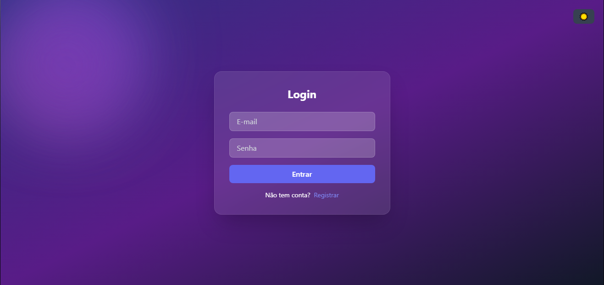
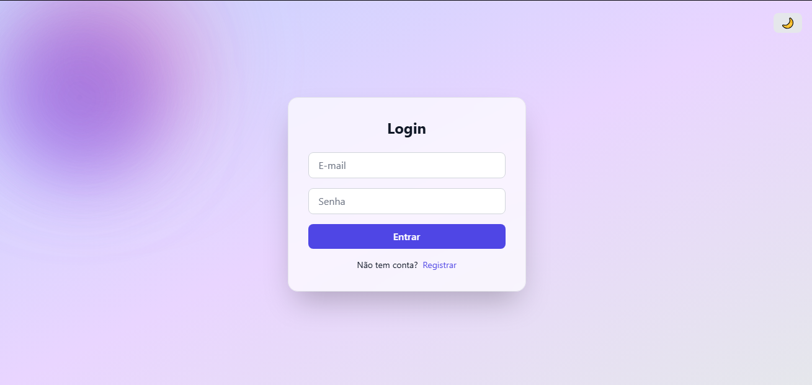

# 🔐 Sistema de Login e Registro

Aplicação web de autenticação com Login e Registro, validações em tempo real, armazenamento local e Dark Mode persistente, desenvolvida com JavaScript puro + TailwindCSS.


## 📸 Preview

<p align="center">
  
</p>

<p align="center">
  
</p>


## 🚀 Sobre o Projeto
Este projeto simula um sistema completo de autenticação no front-end, permitindo:
- Criação de conta
- Login com validação
- Armazenamento de usuários no navegador
- Alternância entre tema claro e escuro
- Interface moderna com animações

O foco foi praticar **manipulação de DOM**, **lógica de validação**, **UX** e **persistência de dados**.


## 🚀 Funcionalidades

- Alternância entre Login e Registro
- Validação de campos obrigatórios
- Validação de e-mail com RegEx
- Senha com mínimo de 6 caracteres
- Destaque visual para campos inválidos
- Mensagens de erro e sucesso dinâmicas
- Armazenamento de usuários no localStorage
- Persistência de tema (Dark / Light Mode)
- Interface responsiva com animações CSS


## 🛠️ Tecnologias

- HTML5
- JavaScript (ES Modules)
- TailwindCSS
- CSS Animations
- LocalStorage API


## 📂 Estrutura do Projeto
```
LOGIN-REGISTER-PROJECT/
│
├── assets/
├── node_modules/
├── public/
├── src/
│   ├── counter.js
│   ├── javascript.svg
│   ├── main.js
│   └── style.css
│
├── .gitignore
├── index.html
├── package.json
├── package-lock.json
├── postcss.config.js
└── tailwind.config.js
```

## 🧠 Como Funciona
### 🔐 Registro
- Valida os campos
- Verifica se o e-mail já está cadastrado
- Salva o usuário no localStorage

### 🔓 Login

- Valida os dados inseridos
- Compara com os usuários salvos
- Retorna sucesso ou erro

### 🌙 Dark Mode

- Alternância via botão
- Tema salvo no localStorage


## ▶️ Como Executar o Projeto
```
npm install
npm run dev
```
Depois, acesse a URL gerada pelo Vite no terminal.


## ⚠️ Observação
Este projeto é para fins de **estudo**.
- Não possui backend
- Não possui criptografia de senha
- Não é indicado para produção


## 👨‍💻 Autor
Catharina Alves Bonella
